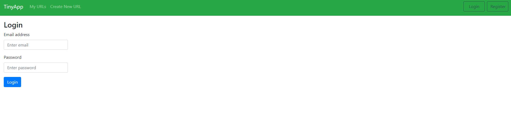
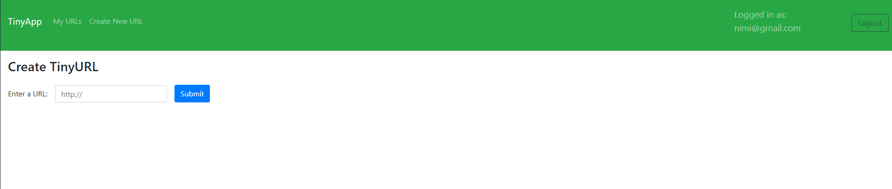
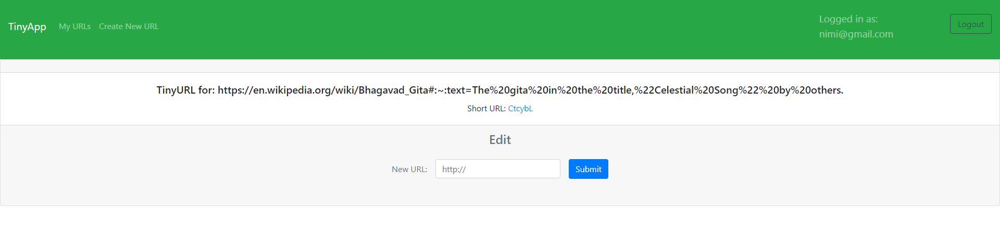
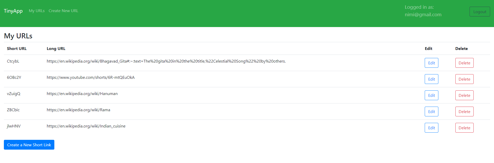

- Want to share food receip links or Holy books link to your friends but your links are too long? Don't let that stop you from spreading joy!

- TinyApp is a full stack web application built with Node and Express that allows users to shorten long URLs (à la bit.ly).

- This project Implemented by Nimisha Gajjar for the Lighthouse Labs Web Development Bootcamp.

Final Product:

## Dependencies

- Node.js
- Express
- EJS
- bcryptjs
- cookie-session

## Getting Started

- Install all dependencies (using the `npm install` command).
- Run the development web server using the `node express_server.js` command.
- Go to http://localhost:8080/ in your browser to access the TinyApp.

